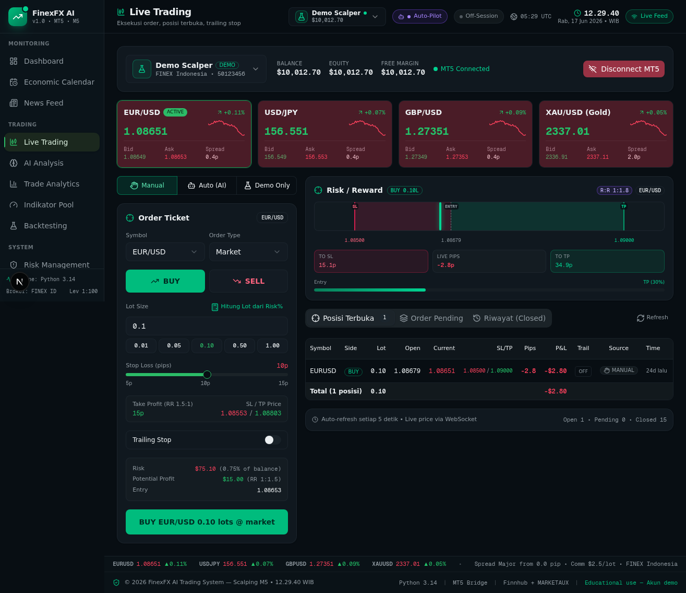

# frxAI — FinexFX AI Trading System

AI-powered Forex trading dashboard dengan analisis teknikal otomatis, news sentiment, backtesting, dan integrasi MetaTrader 5.


## Fitur Utama

- **Trading Panel** — Eksekusi buy/sell dengan SL, TP, trailing stop, dan partial close
- **AI Analysis** — Sinyal trading berbasis LLM dengan evaluasi akurasi real-time
- **Auto-Pilot** — Mode trading otomatis yang dikendalikan AI
- **Technical Indicators** — Pool indikator teknikal (trend, oscillator, volume, volatility, channel, regression) dengan preset scalping
- **Market News** — Feed berita dengan sentiment analysis (Finnhub, MARKETAUX, atau LLM-synthesized)
- **Economic Calendar** — Kalender event ekonomi berdampak tinggi (NFP, CPI, GDP, dll.)
- **Risk Management** — Panel risiko dengan monitoring SL/TP otomatis
- **Backtesting** — Uji strategi trading pada data historis
- **Analytics** — Dashboard statistik dan equity curve
- **Price Alerts** — Notifikasi saat harga menyentuh level tertentu
- **Multi-Account** — Dukungan beberapa akun MT5 (demo/live)
- **Real-time Price Feed** — Harga real-time via WebSocket
- **Webhook Notifications** — Discord, Telegram, Slack
- **Authentication** — Login dengan role-based access (admin, trader, viewer)
- **Dark/Light Theme** — Tema gelap dan terang
- **Responsive** — Mendukung desktop dan mobile

## Tech Stack

| Kategori | Teknologi |
|---|---|
| Framework | Next.js 16 (App Router) |
| UI | React 19, Tailwind CSS 4, shadcn/ui |
| Bahasa | TypeScript 5 |
| Database | Prisma ORM + SQLite |
| Runtime | Bun |
| Auth | NextAuth.js v4 |
| State | Zustand (client), TanStack Query (server) |
| Charts | Recharts |
| Animasi | Framer Motion |
| Real-time | Socket.IO Client |
| AI | z-ai-web-dev-sdk (LLM, VLM) |
| Forms | React Hook Form + Zod |
| Icons | Lucide React |
| Proxy | Caddy (reverse proxy dengan port routing) |

## Arsitektur

```
frxAI/
├── src/
│   ├── app/                    # Next.js App Router
│   │   ├── api/                # 23 API route groups
│   │   │   ├── accounts/       # Manajemen akun trading
│   │   │   ├── ai/             # AI analysis & signals
│   │   │   ├── alerts/         # Price alerts
│   │   │   ├── analytics/      # Statistik & chart
│   │   │   ├── auth/           # Authentication
│   │   │   ├── backtest/       # Backtesting engine
│   │   │   ├── dashboard/      # Dashboard data
│   │   │   ├── economic-calendar/ # Event ekonomi
│   │   │   ├── indicators/     # Technical indicators
│   │   │   ├── mt5/            # MetaTrader 5 bridge
│   │   │   ├── news/           # Market news
│   │   │   ├── notifications/  # Webhook notifications
│   │   │   ├── orders/         # Pending orders
│   │   │   ├── risk/           # Risk management
│   │   │   ├── sessions/       # Trading sessions
│   │   │   ├── strategies/     # Trading strategies
│   │   │   ├── symbols/        # Symbol management
│   │   │   ├── trades/         # Trade execution
│   │   │   └── users/          # User management
│   │   ├── login/              # Login page
│   │   ├── layout.tsx          # Root layout
│   │   ├── page.tsx            # Main dashboard (SPA)
│   │   └── globals.css         # Global styles
│   ├── components/
│   │   ├── layout/             # Layout components
│   │   ├── panels/             # 12 dashboard panels
│   │   │   ├── ai-panel.tsx
│   │   │   ├── alerts-panel.tsx
│   │   │   ├── analytics-panel.tsx
│   │   │   ├── backtest-panel.tsx
│   │   │   ├── calendar-panel.tsx
│   │   │   ├── dashboard-panel.tsx
│   │   │   ├── indicators-panel.tsx
│   │   │   ├── logs-panel.tsx
│   │   │   ├── news-panel.tsx
│   │   │   ├── risk-panel.tsx
│   │   │   ├── settings-panel.tsx
│   │   │   └── trading-panel.tsx
│   │   ├── trading/            # Trading-specific components
│   │   └── ui/                 # shadcn/ui components
│   ├── hooks/                  # Custom React hooks
│   │   ├── use-active-account.ts
│   │   ├── use-auto-pilot.ts
│   │   ├── use-mobile.ts
│   │   └── use-price-feed.ts
│   └── lib/                    # Utilities & server logic
│       ├── ai.ts               # AI integration (z-ai-web-dev-sdk)
│       ├── ai-evaluation.ts    # AI signal evaluation
│       ├── api.ts              # API client
│       ├── auth-config.ts      # NextAuth configuration
│       ├── auth-server.ts      # Server-side auth helpers
│       └── db.ts               # Prisma client
├── mini-services/              # Independent microservices
│   ├── mt5-bridge/             # MetaTrader 5 integration (Python + Node.js)
│   ├── price-feed/             # Real-time price WebSocket feed
│   └── sl-tp-monitor/          # Stop Loss / Take Profit monitor
├── prisma/
│   └── schema.prisma           # Database schema (12 models)
├── Caddyfile                   # Reverse proxy config
└── .env.example                # Environment variables template
```

## Quick Start

### Prasyarat

- [Bun](https://bun.sh/) v1.3+
- [Git](https://git-scm.com/)

### Instalasi

```bash
# 1. Clone repository
git clone https://github.com/teekar2312/frxAI.git
cd frxAI

# 2. Install dependencies
bun install

# 3. Setup environment
cp .env.example .env
# Edit .env sesuai kebutuhan (lihat bagian Environment Variables)

# 4. Setup database
bun run db:push
bun run db:generate

# 5. (Opsional) Seed user admin
bun run seed:auth

# 6. Jalankan development server
bun run dev
```

Buka `http://localhost:3000` di browser.

### Mini-Services (Opsional)

```bash
# Price feed service (port terpisah)
cd mini-services/price-feed
bun install
bun --hot index.ts

# SL/TP monitor service
cd mini-services/sl-tp-monitor
bun install
bun --hot index.ts

# MT5 bridge (memerlukan Python & MetaTrader 5)
cd mini-services/mt5-bridge
bun install
# Lihat mini-services/mt5-bridge/README.md untuk detail
```

## Environment Variables

| Variable | Deskripsi | Default |
|---|---|---|
| `DATABASE_URL` | URL database SQLite (absolute path) | `file:/home/z/my-project/db/custom.db` |
| `MT5_LOGIN` | MT5 account login | — |
| `MT5_PASSWORD` | MT5 account password | — |
| `MT5_SERVER` | MT5 server name | — |
| `NEWSAPI_KEY` | NewsAPI.io key | — |
| `MARKETAUX_KEY` | MarketAux API key | — |
| `FINNHUB_KEY` | Finnhub API key | — |
| `DISCORD_WEBHOOK_URL` | Discord webhook URL | — |
| `TELEGRAM_BOT_TOKEN` | Telegram bot token | — |
| `TELEGRAM_CHAT_ID` | Telegram chat ID | — |
| `SLACK_WEBHOOK_URL` | Slack webhook URL | — |

## Database Models

| Model | Deskripsi |
|---|---|
| `Account` | Akun trading MT5 (demo/live), balance, equity, margin |
| `Trade` | Posisi terbuka/tertutup, PnL, pips, MT5 ticket |
| `Order` | Pending orders (limit/stop) |
| `Indicator` | Pool indikator teknikal dengan preset scalping |
| `NewsItem` | Feed berita pasar (category, impact, sentiment) |
| `Alert` | Price alerts dengan kondisi & notifikasi |
| `Log` | System logs (info, warn, error, debug) |
| `Backtest` | Hasil backtesting (equity curve, win rate, dll.) |
| `AiSignal` | Sinyal trading dari AI (direction, confidence, reasoning) |
| `AiSignalOutcome` | Evaluasi akurasi sinyal AI |
| `RiskSetting` | Pengaturan risiko (key-value) |
| `Notification` | Riwayat notifikasi |
| `SystemConfig` | Konfigurasi sistem (key-value) |
| `User` | Pengguna dengan role-based access |
| `UserSession` | Sesi login untuk audit |
| `EconomicEvent` | Event ekonomi berdampak (NFP, CPI, GDP, dll.) |

## Scripts

| Command | Deskripsi |
|---|---|
| `bun run dev` | Jalankan development server (port 3000) |
| `bun run build` | Build untuk production |
| `bun run start` | Jalankan production server |
| `bun run lint` | ESLint check |
| `bun run test` | Jalankan tests |
| `bun run db:push` | Push schema ke database |
| `bun run db:generate` | Generate Prisma client |
| `bun run db:migrate` | Jalankan migration |
| `bun run db:reset` | Reset database |
| `bun run seed:auth` | Seed user admin default |

## Caddy Reverse Proxy

Repository ini menggunakan Caddy sebagai reverse proxy dengan fitur port-based routing via query parameter `XTransformPort`:

```
GET /api/price?XTransformPort=3001  →  localhost:3001
GET /api/mt5?XTransformPort=3002   →  localhost:3002
GET /                               →  localhost:3000 (default)
```

## Screenshots



## Kontribusi

1. Fork repository ini
2. Buat branch fitur baru: `git checkout -b feature/fitur-baru`
3. Commit perubahan: `git commit -m 'Add fitur baru'`
4. Push ke branch: `git push origin feature/fitur-baru`
5. Buat Pull Request

## Lisensi

[MIT](LICENSE)